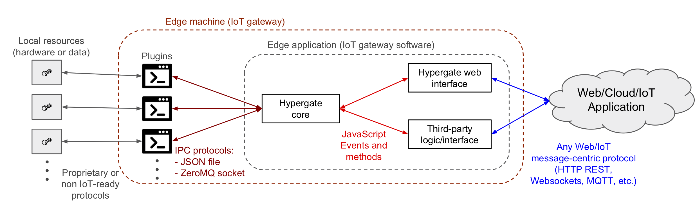

# Introduction
Hypergate is a library for the integration of local resources to the Internet of Things (IoT).
It can be used for creating edge applications and IoT gateway software by combining
resource-specific applications (plugins) with protocol-specific modules (web interfaces).

The core module provides a single class called [`Hypergate`](./packages/hypergate-core/README.md#Hypergate) which controls the execution
of plugins and emits events that can be used by a web interface to relay messages to web/cloud 
applications.

A plugin can be any script or executable located in the local machine that independently 
implements the logic for interacting with a local resource. 

A web interface is usually a wrapper of a common JavaScript library and 
transforms the events emmited by an Hypergate instance in messages of a well-known network 
protocol. Some of the availables web interfaces are: 
* [hypergate-socketio-server](./packages/hypergate-socketio-server/README.md): provides a WebSocket server using the popular 
[Socket.IO library](https://github.com/socketio/socket.io).
* [hypergate-express](./packages/hypergate-express/README.md): creates a REST web application using the popular 
[Express framework](http://expressjs.com).
* [hypergate-mqtt](./packages/hypergate-mqtt/README.md): provides a MQTT client usign the popular 
[MQTT.js library](https://github.com/mqttjs/MQTT.js/blob/master/README.md)
* [hypergate-aws-mqtt](./packages/hypergate-aws-mqtt/README.md): provides a MQTT client device for the AWS IoT Platform using the 
[aws-iot-device-sdk.js package](https://github.com/aws/aws-iot-device-sdk-js)  

# Schema of a typical Hypergate-based IoT application


# Installation
````
npm install @josefransaenz/hypergate-core
````