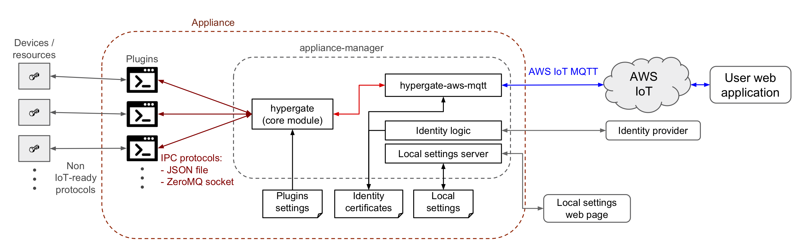

# Appliance Manager
appliance-manager is a demo IoT gateway application build on top of [__hypergate core__](../hypergate/README.md) and 
[__hypergate-aws-mqtt__](../hypergate-aws-mqtt/README.md) modules and allows the integration of devices, algorithms 
and administrative scripts to a web application based on Amazon Web Services Internet of Things Core ([AWS IoT Core](https://aws.amazon.com/iot-core/)) service. 

## Application schema and functional description

When the application starts it verify that it has the proper certificates for accesing the AWS IoT platform and if not it requires them to the an
Identity provider service. Then it loads the Plugins settings from a JSON file, initialize the Hypergate Instance and connects to the AWS IoT
platform usign the identity certificates. The application uses another JSON file for reading the location of the Identity provider server, storing 
the application identification number and local network settings. It also provides a local HTTP server for viewing and modifying some of the settings. 

## Installation and settings
Install the appliance-manager package (or the executable file) in a folder containing the following: 
* a `plugins.json` file containing the specification of the plugins to be used in the format 
need by the [__hypergate core__](../hypergate/README.md) core module
* a `/certificate` folder containing the .pem file for the certification authority
* a `config.json` file containing an object with the following attributes: 
  * `host`: URL of the AWS IoT endpoint
  * `clientId`: [optional] unique code that identifies the application instance inside the AWS IoT platform (device ID). 
  * `registrationUrl`: URL of the server that assings a new `clientId` and provides the 
  certificates needed by the application to be connected to the AWS IoT endpoint. Certificate
  files are stored in the `/certificate` folder

## Usage
The application acts as a MQTT client subscribed to all messages belonging to the topics 
`{clientId}/command/#` and publish messages to the topics `{clientId}/event/#` (see documentation of  [__hypergate__](../hypergate/README.md)). All messages and errors are logged in the console.

The application also provides a local HTTP server for local settings with the following endpoints:
* http://localhost:3000/clientId : useful for obtaining the clientId of the instance from the 
local network
* http://localhost:3000/wifi : for configuring the connection to a Wi-Fi
network for accessing the internet